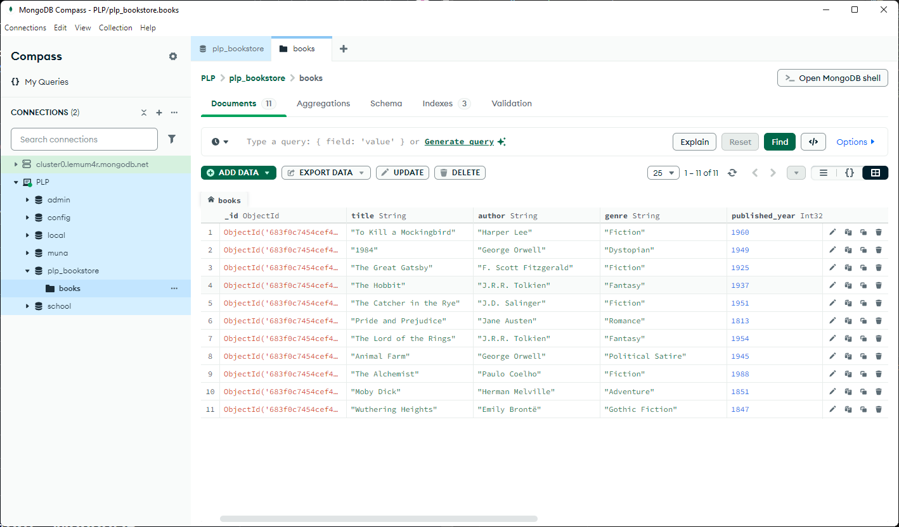

# MongoDB Bookstore Assignment

## Overview
This project demonstrates fundamental MongoDB operations using a sample bookstore database. It includes scripts to populate the database with book data and perform various queries, updates, deletions, aggregations, and indexing operations. The project is suitable for learning and practicing MongoDB basics with both the shell and Node.js driver.

## Project Structure
- `insert_books.js` – Node.js script to populate the `plp_bookstore` database with sample book data.
- `queries.js` – MongoDB shell queries and aggregation pipelines for interacting with the `books` collection.
- `README.md` – Project documentation and instructions.
- `updated_screenshot_of_populated_database.png` – Screenshot of the populated database (if present).
- `img_of_database.png` – Additional screenshot (if present).

## Prerequisites
- [Node.js](https://nodejs.org/) installed
- [MongoDB](https://www.mongodb.com/try/download/community) server running locally or accessible remotely
- [MongoDB Compass](https://www.mongodb.com/products/compass) (optional, for GUI)

## How to Populate the Database

### Using Node.js Script
1. Install dependencies:
   ```powershell
   npm install mongodb
   ```
2. Start your MongoDB server (if not already running).
3. Run the script:
   ```powershell
   node insert_books.js
   ```
   This will connect to your local MongoDB instance, drop the existing `books` collection if it exists, and insert the sample book data.

### Using MongoDB Compass
1. Open MongoDB Compass and connect to your MongoDB server.
2. Select or create the `plp_bookstore` database.
3. Select or create the `books` collection.
4. Click the "Insert Document" button.
5. Copy the array of book objects from `insert_books.js` (the `books` array).
6. Paste the array into the JSON view and insert the documents.

## How to Run Queries
- Open `queries.js` and copy any query you want to try.
- Paste it into the MongoDB shell (`mongosh`) or the "Aggregations"/"Filter" tab in MongoDB Compass.

## Example Queries
- Find all books in a genre:
  ```js
  db.books.find({ genre: "Fiction" })
  ```
- Update a book's price:
  ```js
  db.books.updateOne({ title: "To Kill a Mockingbird" }, { $set: { price: 210 } })
  ```
- Aggregation: Average price by genre:
  ```js
  db.books.aggregate([
    { $group: { _id: "$genre", averagePrice: { $avg: "$price" } } }
  ])
  ```

## Screenshots

### Populated Database Example


### Additional Screenshot


### Latest Database Screenshot


## Notes
- The `insert_books.js` script is written for Node.js and uses the official MongoDB driver.
- The `queries.js` file contains MongoDB shell commands and aggregation pipelines for practice.
- If you use MongoDB Compass, insert documents using the GUI as described above.

---

**Author:** Unbornmoral

**Assignment:** Week 1 – MongoDB Fundamentals